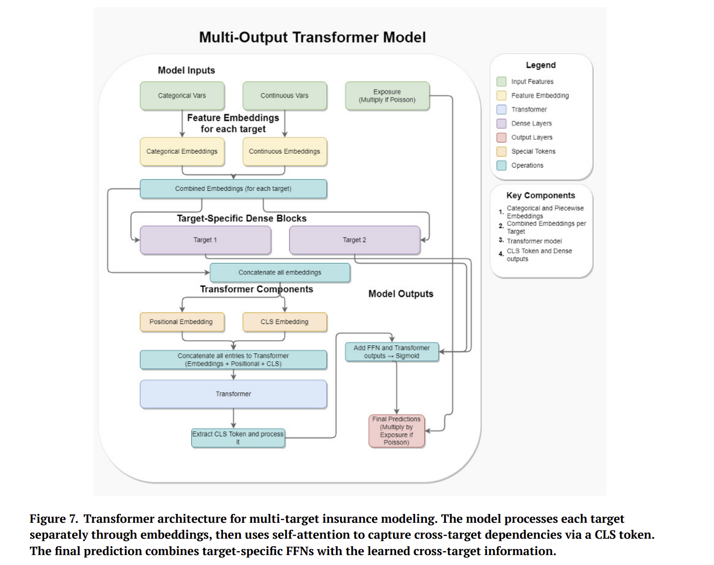
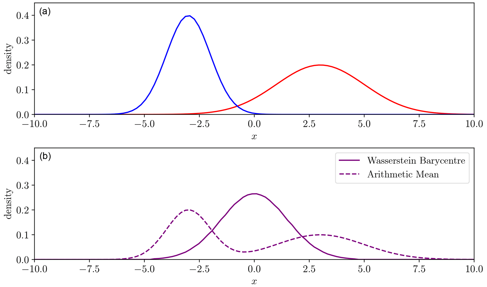
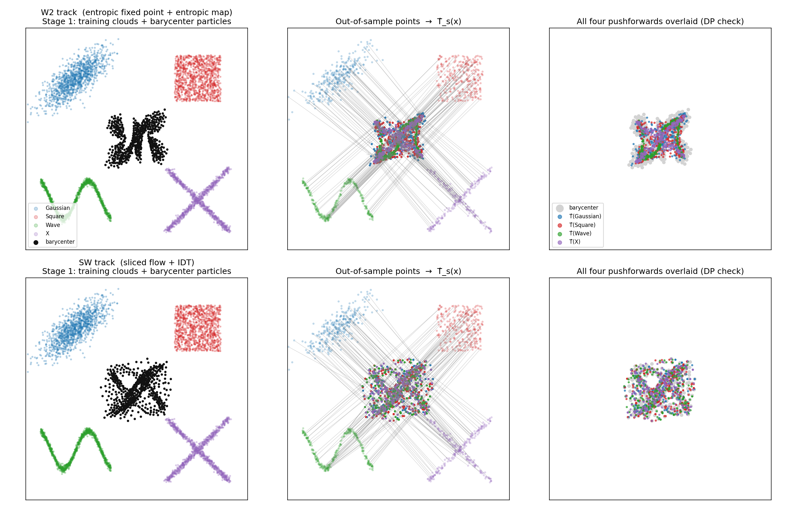

## Sommaire {.smaller background-color="#0f172a"}


- **Discrimination et Équité en Assurance** — Quels sont les aspects de la discrimination et de l'équité en assurance ?
- **Le Problème de Tarification des Risques Dépendants** — Pourquoi nous intéressons-nous à la tarification des risques dépendants ?
- **Une Introduction au Transport Optimal** — Les outils que nous utilisons pour résoudre le problème.
- **Le Cadre pour la Régression Équitable Multivariée** — Comment nous utilisons le transport optimal pour atteindre l'équité DP en assurance multirisque.
- **Applications** — Quelques études de cas pour illustrer le cadre.


# Aspects de la Discrimination et de l'Équité

- Le métier de l'assurance est un métier de discrimination [@AvrahamLogueSchwarcz2014]. Les assureurs discriminent entre les assurés en fonction de leurs caractéristiques de risque pour déterminer la prime.
- Cependant, certaines caractéristiques sont considérées comme sensibles et ne sont pas autorisées à être utilisées pour la tarification, telles que la race, le statut de handicap, l'orientation sexuelle, etc., en vertu de la législation sur les droits de l'homme dans de nombreuses juridictions
- Un aperçu des définitions du biais, de la discrimination et de l'équité [@CIA2023BiasFairness].
- Les modèles peuvent être
  - **directement discriminatoires** : lorsque les caractéristiques sensibles sont utilisées directement dans le modèle, ou
  - **indirectement discriminatoires** : lorsque les caractéristiques sensibles ne sont pas utilisées directement, mais que d'autres variables corrélées avec les caractéristiques sensibles sont utilisées dans le modèle.

- Il n'existe pas de définition/mesure unique de l'équité. L'équité est dynamique et sociale, et non une simple question statistique.

# Les Visions du Monde - WYSIWYG vs WAE


Les auteurs de [@RufBoutharouiteDetyniecki2020] ont discuté de deux visions du monde différentes dans le contexte de l'équité en apprentissage automatique, et proposent une boîte à outils pour l'audit/l'atténuation à chaque étape :

- **Équité individuelle** : des individus similaires doivent être traités de manière similaire. Cela correspond à la vision du monde « What you see is what you get » (ce que vous voyez est ce que vous obtenez).
- **Équité de groupe** : les groupes définis par des caractéristiques sensibles doivent être traités de manière similaire. Cela correspond à la vision du monde « We are equal » (nous sommes égaux).

Chaque vision du monde porte également des hypothèses inhérentes en termes d'espace de Construction, d'Observation et de Prédiction [@yeom2021avoiding].

# Les Notions d'Équité de Groupe

En y regardant de plus près, on trouve trois notions d'équité de groupe couramment discutées dans la littérature de ML :

- Indépendance (ou Parité Démographique) : $Y \perp S$
- Séparation (ou Égalité des Chances) : $\hat Y \perp S \mid Y$
- Suffisance (ou Égalité des Opportunités) : $Y \perp S \mid \hat Y$

L'impossibilité de satisfaire simultanément plusieurs notions d'équité est démontrée dans [@BarocasHardtNarayanan2023] et [@friedler2021possibility].

# Les Dimensions de l'Équité en Tarification Actuarielle

[@CoteCoteCharpentier2025ScalableToolbox] ont considéré le problème de l'équité en tarification actuarielle selon ces trois axes :


# Les trois axes

- Équité actuarielle : c'est ce à quoi les actuaires pensent habituellement -- la prime doit refléter « équitablement » le niveau de risque de l'assuré, i.e. le prime best-estimate :
$$
\mu(\mathbf X, \mathbf D) = \mathbb E[Y \mid \mathbf X, \mathbf D]
$$
- Causalité : cela relève de l'« équité individuelle », et est discuté dans [@LindholmRichmanTsanakasWuthrich2021]. L'objectif est de modifier le prix best-estimate pour qu'il devienne
$$
\mu^*(\mathbf X) := \int_{\mathbf d} \mu(\mathbf X, \mathbf d) \, d\mathbb P^*(\mathbf d)
$$
où la distribution de tarification $\mathbb P^*(\mathbf d)$ a le même support que $\mathbf D \sim \mathbb P(\mathbf d)$
- Solidarité : c'est la propriété d'Indépendance de l'« équité de groupe », obtenu via le transport optimal univarié:
$$
\mu^*(\mathbf x, d) = \sum_{d'} \mathbb P(\mathbf D = d') F^{-1}_{d'}\big(F_d(\mu(\mathbf x, d))\big)
$$


# Le Problème de Tarification en Assurance Multirisque
- De nombreux contrats d'assurance IARD courants, ainsi que les contrats d'assurance santé, regroupent plusieurs garanties dans un seul contrat.
- Exemples :
  - Assurance auto (RC obligatoire) : dommages matériels, dommages corporels
  - Assurance habitation : incendie, vol, dégât des eaux, responsabilité civile, etc.
  - Assurance santé : hospitalisation, soins courants, dentaires, optiques, etc.

- Les méthodes de tarification actuelles reposent sur des modèles de régression univariés, qui ne prennent pas en compte la structure de dépendance entre les différentes garanties.
- Copules sont utilisées dans le domaine du travail par Frees & Shi ([@frees2009actuarial], [@yang2019multiperil])
- Même une tarification univariée peut encore entraîner de la dépendance en raison de l'utilisation de facteurs de risque communs.
- [@Spedicato2025Comparing] ont recensé et comparé les modèles ML/DL pour ce problème.

# Tarification Multirisque



- Le modèle exploite essentiellement les embeddings (en particulier le token CLS) pour apprendre une information latente partagée de la relation entre les risques.
- Étant donné que les modèles ML/DL font souvent l'objet d'un examen d'équité en raison de leur nature de boîte noire, nous les adopterons comme modèle de tarification de base dans nos expérimentations numériques.

## Qu'est-ce qui a été proposé en termes d'atténuation de l'équité ?

- [@charpentier2023mitigating] s'appuie sur les résultats de [@chzhen2020fair] pour étudier la Parité Démographique
- [@denuit2026balance] et [@xi2025fairreweighing] ont récemment étudié la notion de Suffisance et de Séparation dans le cadre de la régression
- [@Lindholm2023multitaskDFIP] a appliqué l'approche de réseau de neurones multitâche à l'axe « Causal » pour estimer conjointement le prix best-estimate et les probabilités $\mathbb P$. Bien qu'appliqué au problème de tarification univarié, je pense que cela peut être étendu au cas multivarié grâce à la flexibilité du réseau de neurones multitâche.
- [@hu2023multitaskfairness] a étudié le problème d'apprentissage multitâche, très proche de notre configuration ; cependant, il ne traite que l'équité par tâche. Dans notre problème, nous montrerons pourquoi l'équité conjointe est importante, car les contrats peuvent être modulables et l'équité dimension par dimension n'assure pas l'équité conjointe dans différentes combinaisons.
- Nous souhaitons aller plus loin et l'appliquer au problème de tarification multirisque, en utilisant la théorie du transport optimal.


# Une Introduction au Transport Optimal

Vous avez un tas de sable ayant la forme de la distribution [$\mu$]{.src}.
Vous voulez le remodeler en [$\nu$]{.tgt}.

- Déplacer un grain de $x$ à $y$ coûte $c(x, y)$ — souvent la distance au carré $\|x - y\|^2$.
- Un [**plan de transport**]{.plan} indique *combien* de masse va de chaque $x$ vers chaque $y$.
- Le **transport optimal** = le plan avec le coût total le plus faible.

Le coût total du *meilleur* plan est une **distance** significative entre les deux
distributions.

Formellement, le problème de Monge (1781) peut s'énoncer ainsi : trouver une application $T : X \to Y$ qui transporte [$\mu$]{.src} vers [$\nu$]{.tgt}
(noté $T_\# \mu = \nu$) et qui minimise le coût total :

$$
\inf_{T \,:\, T_\#\mu = \nu} \; \int_X c\big(x,\, T(x)\big)\, d\mu(x)
$$


::: {.callout-warning}
## Le piège
Une application envoie **chaque** point source vers une **unique** destination. On ne peut donc jamais
*diviser* la masse. Transporter un grain ($\delta_{x}$) vers deux tas égaux
($\tfrac12\delta_{y_1} + \tfrac12\delta_{y_2}$) est **impossible** — aucune $T$ valide
n'existe. Le problème peut être mal posé.
:::

## La Relaxation de Kantorovich (1942) : les *plans* de transport {.smaller}

Au lieu d'une application, on optimise sur des **couplages** — des distributions jointes
$\gamma$ sur $X \times Y$ dont les marginales sont [$\mu$]{.src} et [$\nu$]{.tgt} :

$$
\Gamma(\mu,\nu) = \Big\{ \gamma \ge 0 \;:\; \textstyle\int_Y d\gamma = \mu,\;\; \int_X d\gamma = \nu \Big\}
$$

Le coût de transport optimal devient

$$
\mathcal{T}_c(\mu,\nu) \;=\; \inf_{\gamma \in \Gamma(\mu,\nu)} \int_{X\times Y} c(x,y)\, d\gamma(x,y)
$$

- La masse **peut** désormais se diviser — $\gamma(x,\cdot)$ peut se répartir sur plusieurs destinations.
- L'objectif est **linéaire** en $\gamma$ sur un ensemble **convexe** → une solution existe toujours.
- Pour des coûts réguliers, l'optimum de Kantorovich coïncide avec une application de Monge [@villani2009optimal].

Avec des distributions empiriques $\mu = \sum_{i=1}^n a_i \delta_{x_i}$ et $\nu = \sum_{j=1}^m b_j \delta_{y_j}$,
un plan est une matrice $P \in \mathbb{R}^{n \times m}_{+}$ et le coût est $C_{ij} = c(x_i, y_j)$ :

$$
\min_{P \,\ge\, 0} \; \langle C, P \rangle
\quad \text{sous contrainte} \quad
P \mathbf{1}_m = a, \;\; P^\top \mathbf{1}_n = b
$$

- $\langle C, P\rangle = \sum_{ij} C_{ij} P_{ij}$ est le coût total de transport.
- Les sommes des lignes doivent être égales aux poids source $a$ ; les sommes des colonnes aux poids cible $b$.
- Résoluble exactement avec l'algorithme du **simplexe de réseau** / l'algorithme hongrois, complexité temporelle $O(n^3 \log n)$, intraitable pour de grands $n$.

## Le transport sur la droite réelle

Soient $\mu, \nu$ des mesures de probabilité sur $\mathbb R$ ayant un moment d'ordre p fini. Soit $c(x,y) = h(x-y)$ où $h: \mathbb R \to [0, \infty)$ est convexe.

- Si $\mu$ n'a pas d'atome, c'est-à-dire que sa fonction de répartition est continue, alors $F^{-1}_\nu \circ F_\mu$ est une application de transport optimale, unique si $h$ est strictement convexe.
- On a
$$
\min_{\gamma\in\Gamma(\mu,\nu)}\int_{\mathbb R^2}c(x,y)d\gamma(x,y) = \int_0^1 c(F_{\mu}^{-1}(s), F_{\nu}^{-1}(s)) ds
$$

Ceci montre que le transport en dimension 1 est trivial, et ne nécessite numériquement que $O(n\log n)$ pour trier les atomes des mesures empiriques $\mu, \nu$. C'est la base de la méthode utilisée par [@charpentier2023mitigating] et [@hu2023multitaskfairness].

## La distance de Wasserstein

Prenons pour coût une distance élevée à la puissance $p$, i.e. $c(x,y) = d(x,y)^p$ :

$$
W_p(\mu, \nu) \;=\; \left( \inf_{\pi \in \Pi(\mu,\nu)} \int d(x,y)^p \, d\pi(x,y) \right)^{1/p}
$$

- C'est une **métrique** (symétrie, inégalité triangulaire).
- Elle respecte la **géométrie** de l'espace sous-jacent.
- Elle reste significative même lorsque les distributions ont des **supports disjoints**, contrairement à la divergence KL, qui diverge.

## Le barycentre de Wasserstein

Soit $\{\mu_s\}_{s \in \mathcal S}$. Nous cherchons à trouver la mesure $\nu^*$ qui minimise
$$
\nu^* \in {\arg\min}_{\nu} \sum_{s\in\mathcal S}p_s W_2^2(\nu,\mu_s)
$$

Dans le cadre de l'équité, soit $\mu_s$ la loi des prédictions du groupe $s$, et $p_s = \mathbb P(S = s)$, la proportion de la population appartenant au groupe $s$. Nous cherchons à trouver l'application de transport $\mathcal T_s$ de chaque groupe vers le barycentre.



Le barycentre de Wasserstein possède de nombreuses propriétés intéressantes :

- Par rapport à la simple moyenne arithmétique : préservation de la géométrie - pas de problèmes de multimodalité, etc.
- Le barycentre préserve la propriété d'équilibre global, c'est-à-dire que la moyenne du barycentre est le barycentre des moyennes.
- [@chzhen2020fair] a démontré dans le cadre univarié que : parmi les ajustements DP-équitables, le barycentre est optimal en termes d'EQM (erreur quadratique moyenne). Nous généraliserons ce résultat au cas multivarié.

## Un Résultat d'Optimalité

Formellement, soit $(X, S, Y) \in \mathbb R^d \times \mathcal S \times \mathbb R^p$ avec $p_s = \mathbb P(S=s) > 0$ et $\mathbb E\|Y\|^2 < \infty$. Soit

$$
f^*(x, s) := \mathbb E[Y \mid X=x, S=s]
$$

le régresseur de Bayes (non contraint), et pour chaque $s$ soit

$$
\mu_s := \mathcal L(f^*(X, s)\mid S=s) \in\mathcal P_2(\mathbb R^p)
$$

Soit $\nu$ le barycentre $W_2$ de $\{\mu_s\}$ avec poids $\{p_s\}$, et soit $\mathcal T_s = \nabla \phi_s$ l'application de transport optimal poussant $\mu_s$ vers $\nu$. Alors le régresseur $f^*_{DP}(x,s) = \mathcal T_s(f^*(x,s))$ est DP-équitable (c'est-à-dire qu'il transporte tout vers la même loi) et satisfait

$$
f^*_{DP}\in{\arg\min}_{f\in\mathcal F_{DP}} \mathbb E[\|f(X,S) - Y\|^2]
$$

avec un excès de risque exact
$$
\mathbb E[\|f^*_{DP}(X,S) - Y\|^2] - \mathbb E[\|f^*(X,S) - Y\|^2] = \sum_s p_s W_2^2(\mu_s, \nu)
$$


## Algorithme pour trouver le barycentre - la régularisation

Pour relâcher le problème en un problème strictement convexe, [@cuturi2013sinkhorn] propose d'ajouter un terme de pénalité entropique $H(P) = -\sum_{ij} P_{ij}(\log P_{ij} - 1)$ :

$$
\min_{P \in \Pi(a,b)} \; \langle C, P \rangle \;-\; \varepsilon\, H(P)
$$

- La solution unique a la forme $P^\star = \operatorname{diag}(u)\, K \, \operatorname{diag}(v)$, où $K = e^{-C/\varepsilon}$.
- Trouver $u, v$ se ramène à des **rééchelonnages alternés** des lignes et des colonnes :

$$
u \leftarrow \frac{a}{K v}, \qquad v \leftarrow \frac{b}{K^\top u}
$$

- Chaque itération est constituée de quelques produits matrice-vecteur → **adapté au GPU** et **différentiable**, complexité temporelle de seulement $O(n^2)$.

- [@cuturi2014barycenter] propose un algorithme d'itération à point fixe de type Lloyd sur les points de support du barycentre, basé sur la distance de Sinkhorn ci-dessus.

<!-- ```r
INPUT:  measures (N sets of locations + weights)
        X_init  (k support points, d dims)
        b       (barycenter weights, default uniform)
        p_s (importance per measure)

X <- X_init    # Guess where the barycenter's points sit
repeat until EXIT_CONDITION:   # Until barycenter stops moving / max iter reached
    T_sum <- 0                       # (k × d)

    for each measure s (locations Y_s, weights a_s, importance p_s):
        M_s <- pairwise_distances(X, Y_i)
        T_s <- Sinkhorn(b, a_i, M_i, reg)           # for each input measure, solve an OT problem between the current barycenter and that measure
        T_sum <- T_sum + p_s * (1/b) * (T_s * Y_s)  # move each point to the weighted average of where its mass lands

    X <- T_sum

return X
``` -->

## Goulots d'étranglement & Résolutions

L'algorithme ci-dessus consomme encore beaucoup de temps et de mémoire, ce qui le rend intraitable pour des problèmes à grande échelle (par exemple, nos expériences porteront sur ~100K-1M observations).

Solution : le Wasserstein tranché (Sliced Wasserstein) comme substitut ~ complexité temporelle $O(n\log n)$

$$
SW_2^2(\mu, \nu) = \left(\int_{\theta \sim \mathcal U(\mathbb S^{d-1})} W_2^2(\theta_\#\mu, \theta_\#\nu) \, d\theta \right)^{1/2}
$$

Le barycentre de Wasserstein tranché peut également être calculé facilement.

À faire : quelques théorèmes.

## Cadre générique pour le calcul du barycentre

Adapté de [@cuturi2014barycenter], nous proposons un cadre de flux de particules pour trouver un barycentre

```r
ALGORITHME FluxDeParticules(y0, {Z_s}, {p_s}, Oracle, n_iter, step):
    # Boucle du barycentre - étape 1. Seul `Oracle` diffère.
    y <- y0                                    # m particules, initialisation partagée
    for t = 0 to n_iter-1:
        disp <- 0
        for each group s:
            (d_s, cost_s) <- Oracle(y, Z_s)    # déplacement vers mu_s + coût
            disp <- disp + p_s * d_s
        y <- y − step(t) * disp                # step(t)=1 pour W2 ; décroissant pour SW
    return y
```

Nous remplaçons l'`Oracle` par le déplacement correspondant ExactW2 / EntropicW2 / SlicedW2

Une application de transport peut ensuite être obtenue, puis les points hors échantillon peuvent être transportés vers le barycentre.


## Expériences Synthétiques



- Il faudra reformuler l'articulation théorie-aperçu-expérience pour l'équilibrer
- Se référer au mémoire de Master de l'ETHZ [@carassai2024neural] pour voir comment il est structuré.

## Expérimentations

Nous prévoyons d'expérimenter sur deux jeux de données :

- Assurance auto brésilienne (2 dimensions - collision & autres garanties ; genre comme variable sensible)
- Assurance santé européenne (8 garanties ; genre comme variable sensible)

Si possible, je demanderai à Lindholm l'accès à un autre jeu de données (bien que confidentiel)
- Assurance auto (3 dimensions ; race comme variable sensible - 5 catégories)

## Aperçu du Plan

- Résumé Exécutif (aperçu façon article)
- Discrimination et Équité (Revue de littérature) - OK
- Le Problème de Tarification en Assurance Multirisque (Revue + Algorithme utilisé) - OK
- Une Introduction à la Théorie du Transport Optimal (Wasserstein, Wasserstein tranché) - OK
- Le Cadre d'Ajustement de l'Équité (Algorithme, Garanties théoriques) - 50%
- Expériences Numériques (Données synthétiques + réelles) - À FAIRE
- Conclusion & Discussion
    - Operationalizing the framework for audit...


Perspective: Going to do further in the topic in the phd

DIscussions : 
- Convince the jury how it could be applied in the future
- Oversimplify the maths in the presentation


## Références {.smaller}

::: {#refs}
:::
