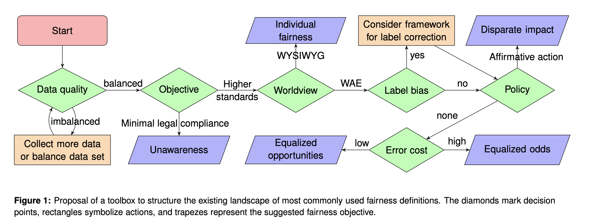
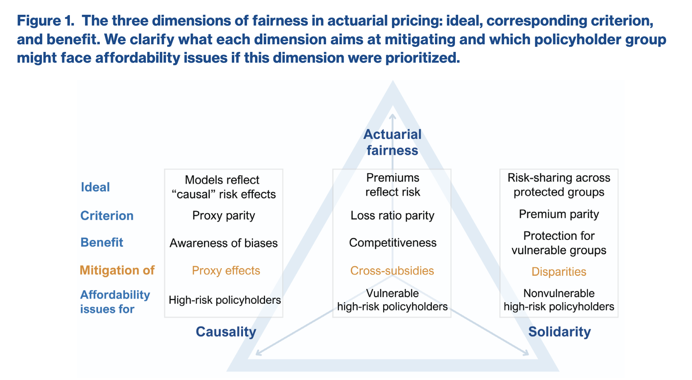

## Agenda {.smaller}

:::
- **Discrimination and Fairness in Insurance** — What are the aspects of discrimination and fairness in insurance?
- **The Dependent Risk Pricing Problem** — Why are we interested in pricing dependent risks?
- **An Introduction to Optimal Transport** — The tools we are using to solve the problem.
- **The Framework to Multivariate Fair Regression** — How we use optimal transport to achieve DP-fairness in multiperil insurance.
- **Applications** — Some case studies to illustrate the framework.
:::

::: {.notes}
Speaker note: keep the framing concrete. The whole talk is "move this pile of
sand onto that hole at minimum cost," then we make it rigorous and then fast.
Press 'S' to open the speaker view with these notes and a timer.
:::

# Aspects of Discrimination and Fairness

- The business of insurance is the business of discrimination [@AvrahamLogueSchwarcz2014]. Insurers discriminate between policyholders based on their risk characteristics to determine the premium.

- However, some characteristics are considered sensitive and are not allowed to be used for pricing, such as race, disability status, sexual orientation, etc. by human rights legislation in many jurisdictions [@CIA2023BiasFairness].

- Models can either be
  - **directly discriminatory**: when the sensitive characteristics are used directly in the model, or
  - **indirectly discriminatory**: when the sensitive characteristics are not used directly, but other features that are correlated with the sensitive characteristics are used in the model.

# Aspects of Discrimination and Fairness

- The business of insurance is the business of discrimination [@AvrahamLogueSchwarcz2014]. Insurers discriminate between policyholders based on their risk characteristics to determine the premium.
- However, some characteristics are considered sensitive and are not allowed to be used for pricing, such as race, disability status, sexual orientation, etc. by human rights legislation in many jurisdictions 
- An overview on the definitions of bias, discrimination and fairness [@CIA2023BiasFairness].
- Models can either be
  - **directly discriminatory**: when the sensitive characteristics are used directly in the model, or
  - **indirectly discriminatory**: when the sensitive characteristics are not used directly, but other features that are correlated with the sensitive characteristics are used in the model.

- No one definition/measure of fairness exists. Fairness is dynamic and social and not a statistical issue.

# The Worldviews - WYSIWYG vs WAE

  
The authors in [@RufBoutharouiteDetyniecki2020] discussed two different worldviews in the context of fairness in machine learning and give a toolbox for auditing/mitigation in each step:

- **Individual fairness**: similar individuals should be treated similarly. This corresponds to the "What you see is what you get" worldview. 
- **Group fairness**: groups defined by sensitive characteristics should be treated similarly. This corresponds to the "We are equal" worldview. 

Each worldview also carries inherent assumptions in terms of the Construct, Observed and Predicted space [@yeom2021avoiding].

# The Notions of Group Fairness

Look further, we have three notions of group fairness commonly discussed in the ML literature:  

- Independence (or Demographic Parity): $Y \perp S$  
- Separation (or Equalized Odds): $\hat Y \perp S \mid Y$  
- Sufficiency (or Equal Opportunities): $Y \perp S \mid \hat Y$  

The independence property is studied extensively in regression problems [@chzhen2020fair], whereas research on the other two properties are mostly focused in classification problems, with the exception for the very recent preprints [@denuit2026balance] for separation and [@xi2025fairreweighing].

The impossibility of satisfying several notions of fairness are proven in [@BarocasHardtNarayanan2023] and [@friedler2021possibility].

# The Dimensions of Fairness in Actuarial Pricing




[@CoteCoteCharpentier2025ScalableToolbox] considered the Fairness problem in Actuarial Pricing along these three axes:

- Actuarial Fairness: this is what actuaries usually think about -- the premium should "fairly" reflect the level of riskyness of the insured.
- Causality: this belongs to the "individual fairness", and is discussed in [@LindholmRichmanTsanakasWuthrich2021]
- Solidarity: this is the Independence property of "group fairness".

The paper outlines ways to quantify the impact of each dimension... 

# The Multiperil Insurance Pricing Problem {background-color="#0f172a"}

- Many common P&C insurance policies, as well as health insurance policies, bundle multiple guarantees in a single contract.
- Examples: 
  - Auto (MTPL) insurance: property damages, bodily injuries
  - Home insurance: fire, theft, water damage, liability, etc.
  - Health insurance: hospitalization, outpatient care, dental care, vision care, etc.

- Current pricing methods are based on univariate regression models, which do not take into account the dependence structure between the different guarantees.
- Even pricing univariately still can result in dependence due to the use of common risk factors.
- [@Spedicato2025Comparing] have surveyed and compare between ML/DL models for this problem.

# What has been proposed for this problem in terms of fairness mitigation?


## Moving a sandpile {.smaller}

You have a pile of sand shaped like distribution [$\mu$]{.src}.
You want to reshape it into [$\nu$]{.tgt}.

::: {.incremental}
- Moving a grain from $x$ to $y$ costs $c(x, y)$ — often the squared distance $\|x - y\|^2$.
- A [**transport plan**]{.plan} says *how much* mass goes from each $x$ to each $y$.
- **Optimal transport** = the plan with the lowest total cost.
:::

. . .

::: {.callout-note}
The total cost of the *best* plan is a meaningful **distance** between the two
distributions — this is the idea that makes OT so useful.
:::

# Monge's Problem {background-color="#0f172a"}

## Monge (1781): transport *maps* {.smaller}

Find a map $T : X \to Y$ that pushes [$\mu$]{.src} onto [$\nu$]{.tgt}
(written $T_\# \mu = \nu$) and minimizes the total cost:

$$
\inf_{T \,:\, T_\#\mu = \nu} \; \int_X c\big(x,\, T(x)\big)\, d\mu(x)
$$

. . .

::: {.callout-warning}
## The catch
A map sends **each** source point to a **single** destination. So you can never
*split* mass. Transporting one grain ($\delta_{x}$) onto two equal piles
($\tfrac12\delta_{y_1} + \tfrac12\delta_{y_2}$) is **impossible** — no valid $T$
exists. The problem can be ill-posed.
:::

# Kantorovich's Relaxation {background-color="#0f172a"}

## Kantorovich (1942): transport *plans* {.smaller}

Instead of a map, optimize over **couplings** — joint distributions
$\pi$ on $X \times Y$ whose marginals are [$\mu$]{.src} and [$\nu$]{.tgt}:

$$
\Pi(\mu,\nu) = \Big\{ \pi \ge 0 \;:\; \textstyle\int_Y d\pi = \mu,\;\; \int_X d\pi = \nu \Big\}
$$

The optimal transport cost becomes

$$
\mathcal{T}_c(\mu,\nu) \;=\; \inf_{\pi \in \Pi(\mu,\nu)} \int_{X\times Y} c(x,y)\, d\pi(x,y)
$$

::: {.incremental}
- Mass **can** now split — $\pi(x,\cdot)$ may spread over many destinations.
- The objective is **linear** in $\pi$ over a **convex** set → a solution always exists.
- For nice costs, the Kantorovich optimum coincides with a Monge map [@villani2009optimal].
:::

# Wasserstein Distance {background-color="#0f172a"}

## A metric between distributions {.smaller}

Take the cost to be a distance to the power $p$, i.e. $c(x,y) = d(x,y)^p$:

$$
W_p(\mu, \nu) \;=\; \left( \inf_{\pi \in \Pi(\mu,\nu)} \int d(x,y)^p \, d\pi(x,y) \right)^{1/p}
$$

::: {.columns}
::: {.column width="55%"}
**Why people love it**

- It is a genuine **metric** (symmetry, triangle inequality).
- It respects the **geometry** of the underlying space.
- It stays meaningful even when distributions have **disjoint support** — unlike KL divergence, which blows up.
:::

::: {.column width="45%"}
::: {.callout-tip}
## Earth Mover's Distance
In computer vision, $W_1$ is known as the **Earth Mover's Distance** —
the minimum "work" to turn one histogram into another.
:::
:::
:::

# Discrete OT {background-color="#0f172a"}

## It's just a linear program {.smaller}

With empirical distributions
$\mu = \sum_{i=1}^n a_i \delta_{x_i}$ and $\nu = \sum_{j=1}^m b_j \delta_{y_j}$,
a plan is a matrix $P \in \mathbb{R}^{n \times m}_{+}$ and the cost is $C_{ij} = c(x_i, y_j)$:

$$
\min_{P \,\ge\, 0} \; \langle C, P \rangle
\quad \text{subject to} \quad
P \mathbf{1}_m = a, \;\; P^\top \mathbf{1}_n = b
$$

::: {.incremental}
- $\langle C, P\rangle = \sum_{ij} C_{ij} P_{ij}$ is the total transport cost.
- The row sums must equal the source weights $a$; column sums the target weights $b$.
- Exactly solvable with the **network simplex** / Hungarian algorithm…
- …but that costs roughly $O(n^3 \log n)$ — painful for large $n$.
:::

# Sinkhorn {background-color="#0f172a"}

## Entropic regularization {.smaller}

Add an entropy penalty $H(P) = -\sum_{ij} P_{ij}(\log P_{ij} - 1)$ [@cuturi2013sinkhorn]:

$$
\min_{P \in \Pi(a,b)} \; \langle C, P \rangle \;-\; \varepsilon\, H(P)
$$

::: {.incremental}
- The unique solution has the form $P^\star = \operatorname{diag}(u)\, K \, \operatorname{diag}(v)$, where $K = e^{-C/\varepsilon}$.
- Finding $u, v$ reduces to **alternating rescalings** of rows and columns:

$$
u \leftarrow \frac{a}{K v}, \qquad v \leftarrow \frac{b}{K^\top u}
$$

- Each iteration is a couple of matrix–vector products → **GPU-friendly** and **differentiable**.
:::

## Sinkhorn in ~10 lines {auto-animate="true"}

```{.python code-line-numbers="|1-2|4-5|7-10|12"}
import numpy as np

def sinkhorn(a, b, C, eps=0.1, n_iters=200):
    K = np.exp(-C / eps)          # Gibbs kernel
    u = np.ones_like(a)

    for _ in range(n_iters):       # alternate the two marginal constraints
        v = b / (K.T @ u)
        u = a / (K @ v)

    return u[:, None] * K * v[None, :]   # the transport plan P
```

::: {.notes}
Walk through the line highlights one click at a time:
imports, the kernel, the iteration, then the returned plan.
Mention that in practice you do this in log-space for numerical stability.
:::

## Try it: two point clouds {.smaller}

```{.python}
import numpy as np

rng = np.random.default_rng(0)
X = rng.normal(0.0, 1.0, size=(50, 2))     # source samples
Y = rng.normal(3.0, 1.0, size=(50, 2))     # target samples

a = np.full(50, 1/50)                       # uniform weights
b = np.full(50, 1/50)

# squared-Euclidean cost matrix
C = ((X[:, None, :] - Y[None, :, :])**2).sum(-1)

P = sinkhorn(a, b, C, eps=0.1)
print("transported mass:", P.sum())         # ~ 1.0
print("approx W2^2:", (P * C).sum())         # entropic OT cost
```

::: {.callout-tip}
For production use, reach for the **POT** library (`pip install pot`):
`ot.sinkhorn(a, b, C, reg=0.1)` — it handles log-domain stabilization for you.
:::

# Applications {background-color="#0f172a"}

## Where OT shows up in ML {.smaller}

::: {.columns}
::: {.column width="50%"}
**Generative modeling**

- Wasserstein GANs use $W_1$ as a stabler loss [@arjovsky2017wasserstein].
- Flow- and diffusion-based models borrow OT geometry.

**Domain adaptation**

- Align a labeled source domain to an unlabeled target by transporting features.
:::

::: {.column width="50%"}
**Single-cell biology**

- Infer developmental trajectories by transporting cells across time points.

**NLP & vision**

- *Word Mover's Distance* compares documents via word-embedding transport.
- **Color transfer**: move the color histogram of one image onto another.
:::
:::

. . .

::: {.callout-note}
The common thread: whenever you need to **compare** or **morph** distributions
while respecting geometry, OT is a natural tool [@peyre2019computational].
:::

## Summary {.smaller}

::: {.incremental}
- **Monge** asked for a transport *map* — elegant, but can fail to exist.
- **Kantorovich** relaxed to transport *plans* — convex, always solvable.
- The optimal cost gives the **Wasserstein distance**, a geometry-aware metric.
- Discrete OT is a **linear program**; **Sinkhorn** makes it fast and differentiable.
- OT now powers generative models, domain adaptation, biology, and more.
:::

. . .

::: {.callout-tip}
## One-line takeaway
Optimal transport is the mathematics of *moving distributions at minimum cost* —
and that single idea turns out to be remarkably useful.
:::

## References {.smaller}

::: {#refs}
:::

## Thank you! {.center background-color="#0f172a"}

::: {style="text-align:center; margin-top: 1em;"}
Questions?

Slides built with [Quarto](https://quarto.org) + reveal.js
:::
